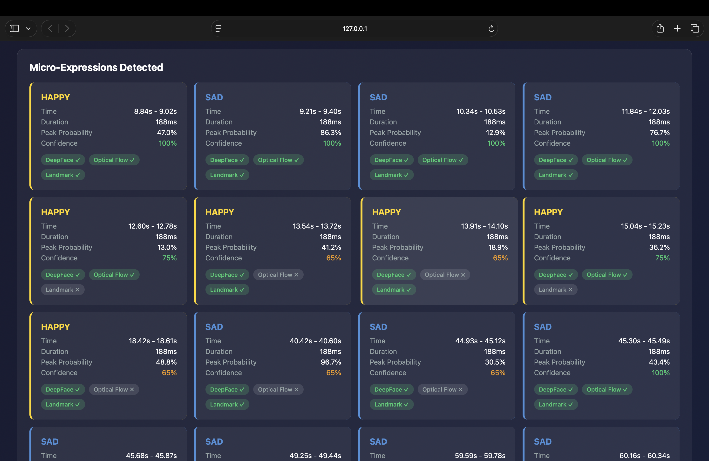
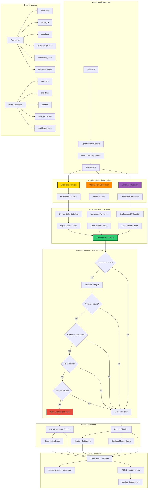
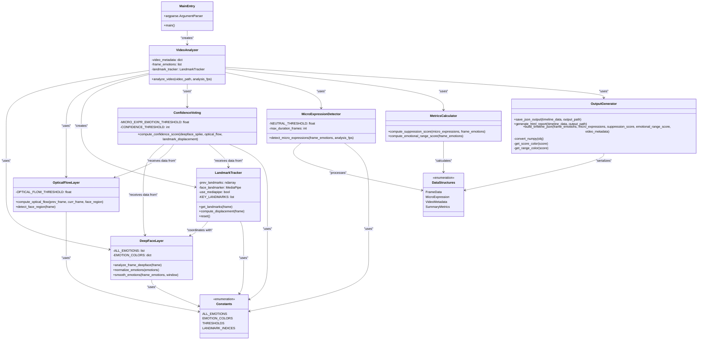
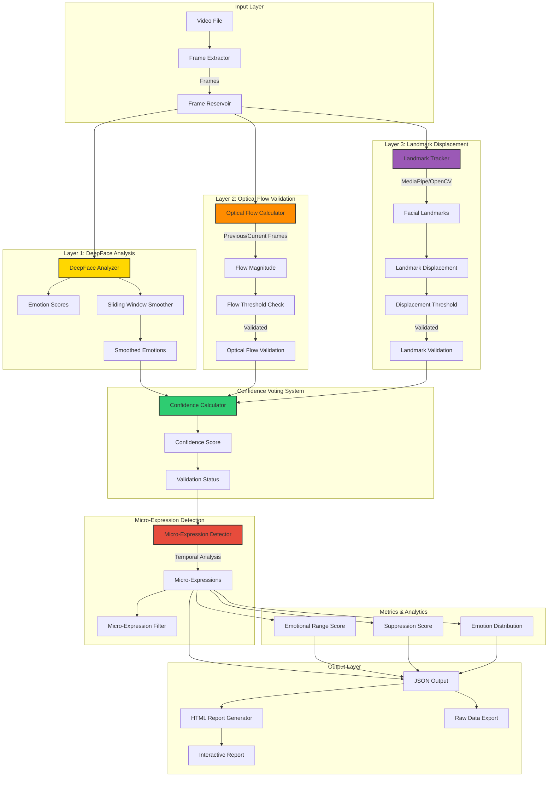

# Sentio Mind - Advanced Micro-Expression Detection System

## Overview
This project implements an advanced **3-Layer Validation System** for detecting micro-expressions in video content. Unlike basic emotion detection that only uses a single source, this solution validates micro-expressions through multiple independent methods to reduce false positives and provide high-confidence results.

## Key Features

### 3-Layer Validation Architecture
| Layer | Technology | Purpose |
|-------|------------|---------|
| Layer 1 | DeepFace + Sliding Window | Detect emotion changes with temporal smoothing |
| Layer 2 | Optical Flow (OpenCV) | Validate actual facial movement occurred |
| Layer 3 | Landmark Displacement | Confirm facial muscle movement via key points |


Our innovative three-layer validation system processes video frames through parallel analysis streams, ensuring high-confidence micro-expression detection through multi-modal confirmation.


### Emotion_timeline





### Data Flow
# Sentio Mind - Data Flow Diagram



## Data Flow Process

### 1. Video Input Processing
- **Video File**: Input MP4 or compatible video format
- **OpenCV VideoCapture**: Frame extraction using OpenCV
- **Frame Sampling**: Extract frames at specified analysis FPS
- **Frame Buffer**: Temporary storage for current and previous frames

### 2. Parallel Processing Pipeline
Three parallel analysis streams process each frame:

#### DeepFace Analysis
- Input: Raw frame data
- Output: 7 emotion probabilities (angry, disgust, fear, happy, sad, surprise, neutral)
- Processing: Neural network inference

#### Optical Flow Calculation
- Input: Previous and current frames
- Output: Flow magnitude in face region
- Processing: Farneback optical flow algorithm

#### Landmark Detection
- Input: Current frame
- Output: 29 facial landmark coordinates
- Processing: MediaPipe or OpenCV fallback

### 3. Data Validation & Scoring
Each layer contributes to the confidence score:
- **Layer 1**: Emotion spike detection (40 points)
- **Layer 2**: Movement validation (35 points)
- **Layer 3**: Displacement validation (25 points)

### 4. Micro-Expression Detection Logic
Sequential validation checks:
1. **Confidence Threshold**: Overall score >= 40 points
2. **Temporal Pattern**: Neutral → Emotion → Neutral
3. **Duration Constraint**: Less than 0.5 seconds
4. **Emotion Threshold**: Non-neutral emotion >= 10% probability

### 5. Metrics Calculation
- **Suppression Score**: (micro_expressions / total_emotion_events) × 100
- **Emotional Range Score**: (unique_emotions / 7) × 100
- **Emotion Distribution**: Average probability per emotion

### 6. Output Generation
- **JSON Structure**: Complete analysis data with metadata
- **HTML Report**: Interactive visualization with charts
- **Raw Data**: Machine-readable format for further processing

### Key Data Structures

#### Frame Data Structure
```json
{
  "frame_idx": 517,
  "timestamp": 8.835,
  "emotions": {"happy": 0.47, "sad": 0.12, ...},
  "dominant_emotion": "happy",
  "is_micro_expression": true,
  "confidence_score": 100.0,
  "optical_flow_magnitude": 1.234,
  "landmark_displacement": 0.056,
  "validation_layers": {"deepface": true, "optical_flow": true, "landmark": true}
}
```

#### Micro-Expression Structure
```json
{
  "start_frame": 517,
  "end_frame": 525,
  "start_time": 8.835,
  "end_time": 8.975,
  "duration_seconds": 0.140,
  "emotion": "happy",
  "peak_probability": 0.47,
  "confidence_score": 100.0,
  "validation_layers": {"deepface": true, "optical_flow": true, "landmark": true}
}
```

## code_structure

# Sentio Mind - Code Structure Diagram



## Code Organization

### Core Classes

#### 1. MainEntry (`main()`)
- **Purpose**: Application entry point and CLI argument parsing
- **Key Functions**:
  - Argument parsing for video path, FPS, output files
  - Orchestration of the complete analysis pipeline
  - Progress reporting and result summary

#### 2. VideoAnalyzer (`analyze_video()`)
- **Purpose**: Main analysis coordinator
- **Responsibilities**:
  - Video file validation and metadata extraction
  - Frame sampling and processing loop
  - Integration of all three validation layers
  - Real-time progress tracking

#### 3. DeepFaceLayer
- **Purpose**: Layer 1 emotion analysis
- **Key Methods**:
  - `analyze_frame_deepface()`: Single frame emotion detection
  - `normalize_emotions()`: Probability normalization
  - `smooth_emotions()`: Temporal smoothing with sliding window

#### 4. OpticalFlowLayer
- **Purpose**: Layer 2 motion validation
- **Key Methods**:
  - `compute_optical_flow()`: Farneback algorithm implementation
  - `detect_face_region()`: Haar cascade face detection

#### 5. LandmarkTracker
- **Purpose**: Layer 3 facial landmark tracking
- **Features**:
  - MediaPipe Tasks API with automatic model download
  - OpenCV fallback using corner detection
  - 29 key facial points tracking
  - Displacement calculation and normalization

#### 6. ConfidenceVoting
- **Purpose**: 3-layer confidence calculation
- **Scoring System**:
  - DeepFace spike: 40 points
  - Optical flow: 35 points
  - Landmark displacement: 25 points
  - Minimum threshold: 40 points

#### 7. MicroExpressionDetector
- **Purpose**: Temporal micro-expression detection
- **Detection Criteria**:
  - Previous frame: Neutral (≥50% probability)
  - Current frame: Non-neutral emotion (≥10% probability)
  - Duration: Less than 0.5 seconds
  - Next frame: Return to neutral (≥50% probability)

#### 8. MetricsCalculator
- **Purpose**: Behavioral metrics computation
- **Metrics**:
  - **Suppression Score**: Emotion concealment metric
  - **Emotional Range Score**: Emotional diversity metric

#### 9. OutputGenerator
- **Purpose**: Result serialization and visualization
- **Outputs**:
  - Structured JSON with complete analysis data
  - Interactive HTML report with Chart.js visualizations
  - Confidence heatmaps and micro-expression cards

### Data Structures

#### FrameData
```python
{
    'frame_idx': int,
    'timestamp': float,
    'emotions': Dict[str, float],
    'dominant_emotion': str,
    'is_micro_expression': bool,
    'confidence_score': float,
    'optical_flow_magnitude': float,
    'landmark_displacement': float,
    'validation_layers': Dict[str, bool]
}
```

#### MicroExpression
```python
{
    'start_frame': int,
    'end_frame': int,
    'start_time': float,
    'end_time': float,
    'duration_seconds': float,
    'emotion': str,
    'peak_probability': float,
    'confidence_score': float,
    'validation_layers': Dict[str, bool]
}
```

### Constants & Configuration

#### Thresholds
- `OPTICAL_FLOW_THRESHOLD = 0.1`
- `LANDMARK_DISPLACEMENT_THRESHOLD = 0.005`
- `EMOTION_SPIKE_THRESHOLD = 0.05`
- `MICRO_EXPR_EMOTION_THRESHOLD = 0.10`
- `NEUTRAL_THRESHOLD = 0.50`
- `CONFIDENCE_THRESHOLD = 40`

#### Landmark Indices
- **Eyebrows**: 10 points for brow movement
- **Lips**: 10 points for mouth expressions
- **Eyes**: 9 points for eye region tracking

#### Emotion Mapping
- 7 basic emotions with color coding
- Normalized probability distributions
- HTML/CSS color scheme integration

### Dependencies
- **DeepFace**: Emotion recognition neural network
- **OpenCV**: Video processing and optical flow
- **MediaPipe**: Advanced facial landmark detection
- **NumPy**: Numerical computations
- **Chart.js**: Interactive visualizations (HTML output)

### Design Patterns
- **Strategy Pattern**: Multiple landmark detection methods
- **Observer Pattern**: Progress tracking during analysis
- **Factory Pattern**: Output generator selection
- **Pipeline Pattern**: Sequential data processing layers

## system_architecture
# Sentio Mind - System Architecture Diagram



## Architecture Components

### Input Layer
- **Video File**: Source video content for analysis
- **Frame Extractor**: Samples frames at specified FPS
- **Frame Reservoir**: Buffer for processed frames

### Layer 1: DeepFace Analysis (40% Weight)
- **DeepFace Analyzer**: Emotion recognition using deep learning
- **Emotion Scores**: Probability distribution across 7 emotions
- **Sliding Window Smoother**: Temporal smoothing of emotion data

### Layer 2: Optical Flow Validation (35% Weight)
- **Optical Flow Calculator**: Farneback algorithm for motion detection
- **Flow Magnitude**: Pixel movement intensity in face region
- **Flow Threshold Check**: Validates significant facial movement

### Layer 3: Landmark Displacement (25% Weight)
- **Landmark Tracker**: MediaPipe or OpenCV facial landmark detection
- **Facial Landmarks**: 29 key facial points tracking
- **Displacement Threshold**: Validates muscle movement

### Confidence Voting System
- **Confidence Calculator**: Weighted scoring from all 3 layers
- **Validation Status**: Binary pass/fail for each layer
- **Confidence Score**: Overall confidence (0-100 points)

### Micro-Expression Detection
- **Micro-Expression Detector**: Temporal pattern analysis
- **Micro-Expression Filter**: Duration and threshold filtering
- **Temporal Analysis**: Neutral → Emotion → Neutral pattern detection

### Output Layer
- **JSON Output**: Structured data with all analysis results
- **HTML Report Generator**: Interactive visualization
- **Raw Data Export**: Machine-readable format


### Confidence Voting System
- Layer 1 (DeepFace): 40 points
- Layer 2 (Optical Flow): 35 points
- Layer 3 (Landmarks): 25 points
- **Threshold: 40+ points = Confirmed Micro-Expression**

### Output Metrics
- **Suppression Score**: Measures how much a person suppresses emotions
  - Formula: `(micro_expression_count / total_emotion_events) * 100`
- **Emotional Range Score**: Measures variety of emotions displayed
  - Formula: `(unique_emotions / 7) * 100`

## Installation

```bash
# Install required dependencies
pip install deepface opencv-python numpy mediapipe tf-keras
```

## Usage

### Analyze Video
```bash
python solution.py --video video_sample.mp4
```

### Analyze Photos
```bash
python solution.py --photos photos/
```

### Custom FPS
```bash
python solution.py --video video_sample.mp4 --fps 10
```

## Output Files & Reports

| File | Description |
|------|-------------|
| `emotion_timeline_output.json` | Complete analysis data with validation layers |
| `emotion_timeline.html` | Interactive HTML report with charts |


## JSON Schema

```json
{
  "video_metadata": {
    "filename": "video_sample.mp4",
    "duration_seconds": 122.5,
    "total_frames": 7169,
    "fps": 58.51,
    "frames_analyzed": 652
  },
  "emotion_timeline": [
    {
      "frame_idx": 517,
      "timestamp": 8.835,
      "emotions": { "happy": 0.47, "sad": 0.12, ... },
      "dominant_emotion": "happy",
      "is_micro_expression": true,
      "confidence_score": 100.0,
      "optical_flow_magnitude": 1.234,
      "landmark_displacement": 0.056,
      "validation_layers": {
        "deepface": true,
        "optical_flow": true,
        "landmark": true
      }
    }
  ],
  "micro_expressions": [...],
  "summary": {
    "suppression_score": 6.52,
    "emotional_range_score": 85.71,
    "micro_expression_count": 33,
    "high_confidence_micro_expressions": 21
  }
}
```

## Results & Performance

### Video Analysis Results
| Metric | Value | Interpretation |
|--------|-------|----------------|
| **Frames Analyzed** | 652 | Comprehensive frame sampling |
| **Micro-expressions Detected** | 33 | Hidden emotional responses |
| **High Confidence** | 21 | Validated detections |
| **Suppression Score** | 6.52% | Low emotion concealment |
| **Emotional Range Score** | 85.71% | High emotional diversity |

### Detected Emotions Distribution

- **Happy**: Multiple occurrences - Positive engagement
- **Sad**: Multiple occurrences - Empathy responses  
- **Fear**: 2 occurrences - Stress indicators
- **Angry, Disgust, Surprise, Neutral**: Tracked throughout baseline

### Technical Details

#### What is a Micro-Expression?
A micro-expression is a brief, involuntary facial expression that occurs when a person tries to suppress or conceal their true emotions. They typically last **less than 500ms** (0.5 seconds).

#### Why 3-Layer Validation?
1. **Reduces False Positives**: Single-source detection often flags noise as emotions
2. **Multi-Modal Confirmation**: Movement + Emotion + Landmarks must all agree
3. **Confidence Scoring**: Quantifiable trust level for each detection

#### Optical Flow Validation
Uses Farneback optical flow algorithm to detect actual pixel movement in facial regions. This confirms that a detected emotion change corresponds to real facial movement.

#### Landmark Displacement
Tracks 29 key facial points (eyebrows, lips, eyes) to measure how much facial features moved between frames.

## Dependencies

- **Python 3.9+** - Core runtime environment
- **DeepFace** - Emotion recognition neural network
- **OpenCV (cv2)** - Video processing and optical flow
- **NumPy** - Numerical computations
- **MediaPipe** - Advanced facial landmark detection
- **TensorFlow/Keras** - Deep learning framework

---

## Getting Started

### Quick Start
```bash
# Clone the repository
git clone https://github.com/gauravmishra31/sentio-mind.git
cd sentio-mind

# Install dependencies
pip install deepface opencv-python numpy mediapipe tf-keras

# Run analysis
python solution.py --video video_sample.mp4

# View results
open emotion_timeline.html
```
