# Micro-Expression & Emotion Transition Timeline

Detect sub-second emotion flashes and track emotion transitions over video sessions.

## System Architecture

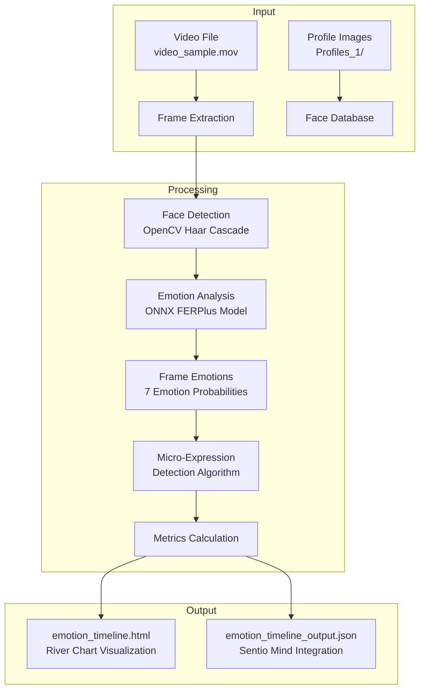

## High-Level System Flow

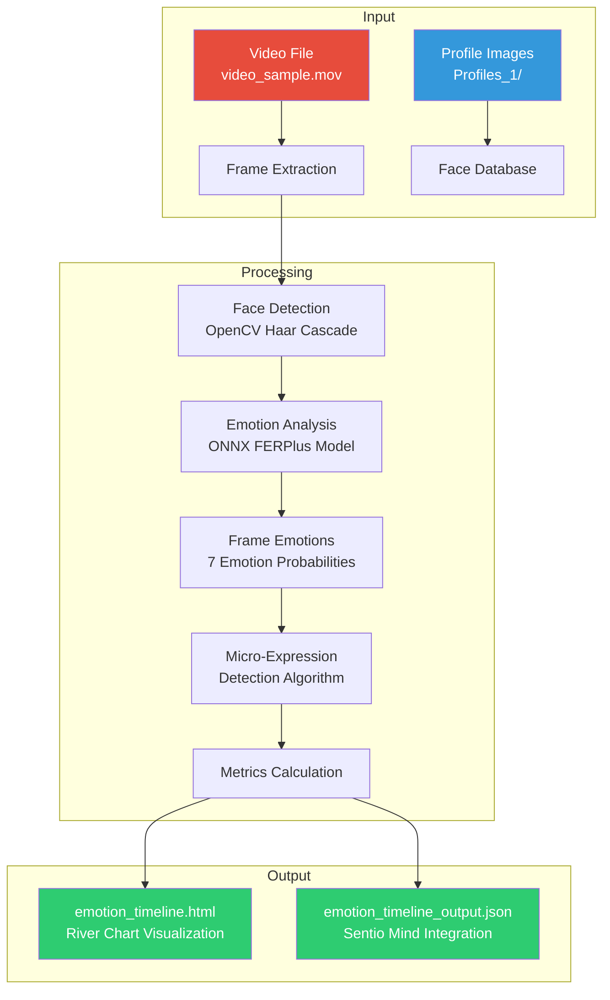

## Emotion Detection Pipeline

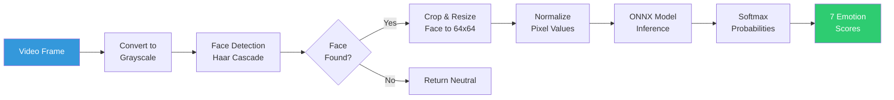

## Micro-Expression Detection Algorithm

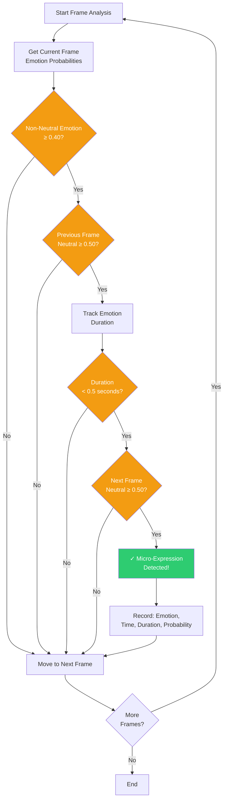

## Derived Metrics Calculation

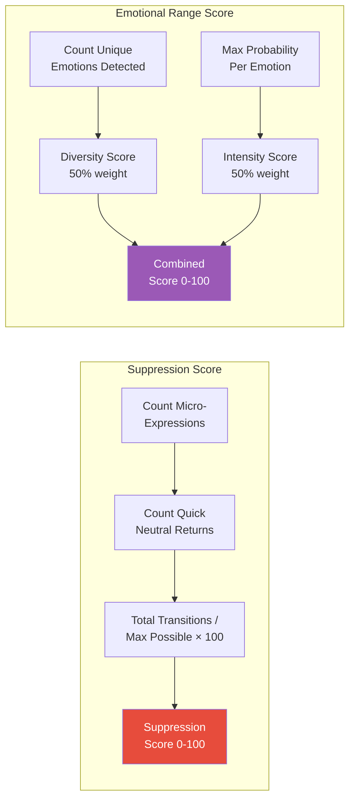

## Output Generation Flow

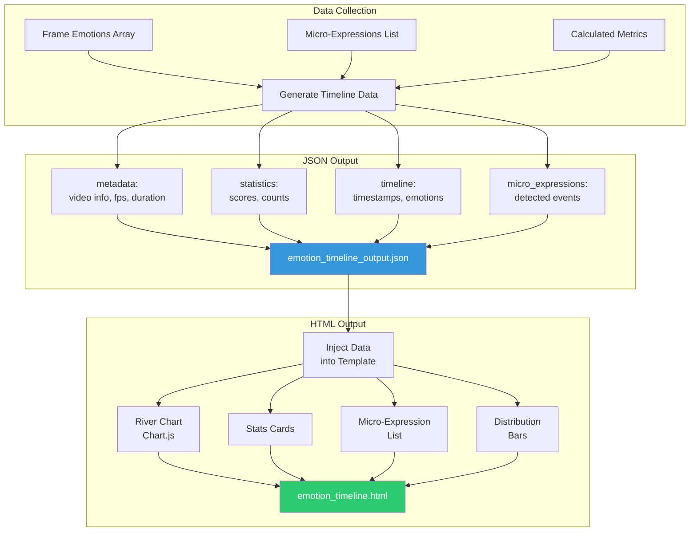

## Emotion Categories

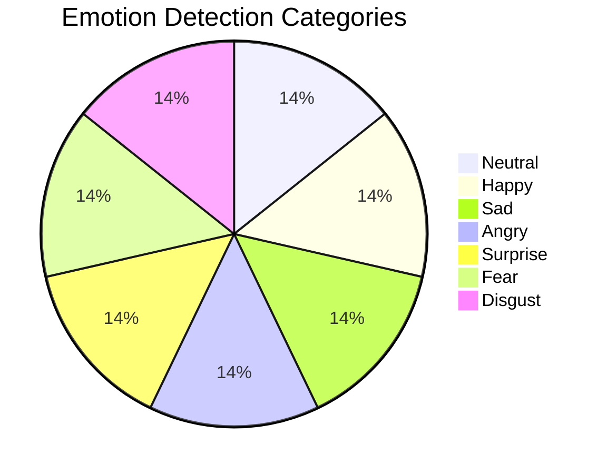

## Class Diagram

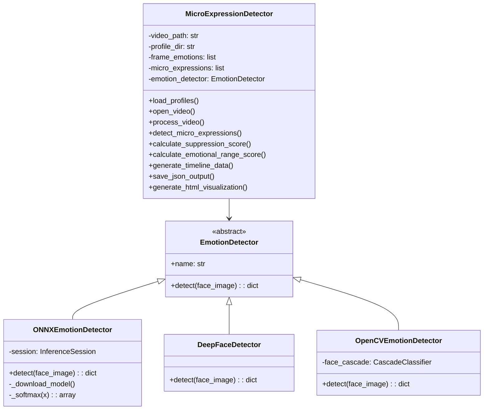

## Sequence Diagram - Full Analysis Flow

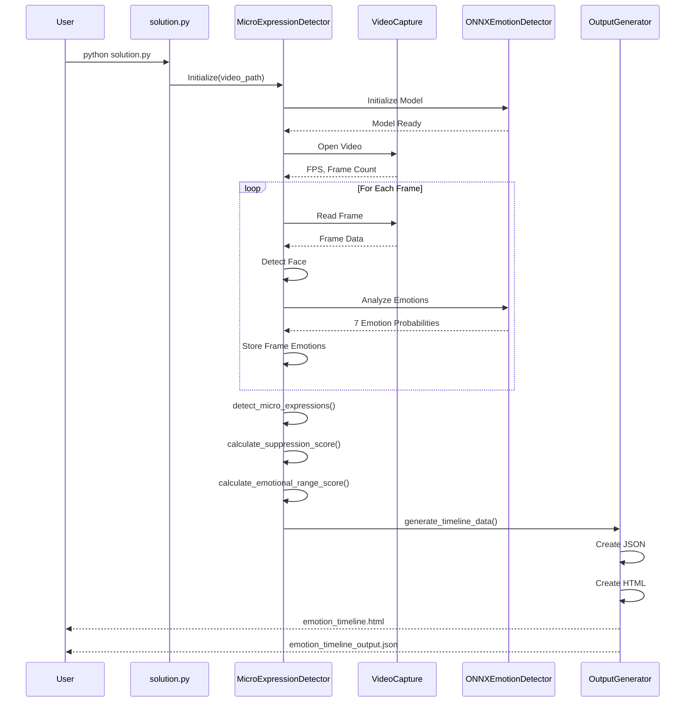

## Problem Statement

While computing one dominant emotion per frame, micro-expressions — genuine emotional flashes lasting < 0.5s before being suppressed — are critical stress signals invisible to single-frame analysis.

## Features

- **Micro-Expression Detection**: Detects emotions lasting < 0.5 seconds
- **Emotion Timeline**: Tracks 7 emotions (angry, disgust, fear, happy, sad, surprise, neutral)
- **Derived Metrics**:
  - **Suppression Score (0-100)**: How often the person shows micro-expressions but immediately returns to neutral
  - **Emotional Range Score (0-100)**: How varied/expressive the person is across the session
- **River Chart Visualization**: Interactive HTML visualization with Chart.js
- **JSON Output**: Integration-ready data for Sentio Mind

## Micro-Expression Definition

A micro-expression is detected when:
- A non-neutral emotion appears suddenly with probability ≥ 0.40
- It lasts < 0.5 seconds (< ANALYSIS_FPS × 0.5 frames)
- It is preceded AND followed by neutral (probability ≥ 0.50)

### Detection Algorithm Flow

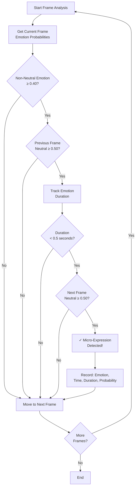

## Installation

```bash
# Install dependencies
pip install -r requirements.txt
```

## Usage

```bash
# Basic usage (uses default video)
python solution.py

# Specify video file
python solution.py path/to/video.mp4

# Custom options
python solution.py video.mp4 --fps 10 --output-json results.json --output-html results.html
```

### Command Line Arguments

| Argument | Default | Description |
|----------|---------|-------------|
| `video` | `Class_8_cctv_video_1.mov` | Path to input video file |
| `--profiles` | `Profiles_1-.../Profiles_1` | Path to profile images directory |
| `--fps` | `10` | Analysis frames per second |
| `--output-json` | `emotion_timeline_output.json` | Output JSON file path |
| `--output-html` | `emotion_timeline.html` | Output HTML file path |

## Output Files

### 1. emotion_timeline.html
Interactive river chart visualization showing:
- Stacked area chart with 7 emotion bands (X = time in seconds)
- Micro-expression events marked with vertical dashed lines + tooltips
- Statistics cards (Suppression Score, Emotional Range Score, etc.)
- Emotion distribution breakdown
- Works offline (Chart.js loaded from CDN with fallback)

### 2. emotion_timeline_output.json
JSON structure for Sentio Mind integration:
```json
{
  "emotion_timeline": {
    "metadata": { ... },
    "statistics": {
      "suppression_score": 0-100,
      "emotional_range_score": 0-100,
      "micro_expression_count": N,
      "dominant_emotions": { ... }
    },
    "timeline": {
      "timestamps": [...],
      "emotions": { "angry": [...], "happy": [...], ... }
    },
    "micro_expressions": [...]
  },
  "person_profiles": {
    "primary": {
      "emotion_timeline": { ... }
    }
  }
}
```

## Project Structure

```
Expression/
├── solution.py                    # Main analysis script
├── requirements.txt               # Python dependencies
├── README.md                      # This file
├── ARCHITECTURE.md                # Detailed Mermaid diagrams
├── .env                           # Environment configuration
├── emotion_timeline.html          # Generated visualization
├── emotion_timeline_output.json   # Generated JSON output
├── models/
│   └── emotion-ferplus-8.onnx     # Auto-downloaded emotion model
└── Profiles_1-.../                # Profile images for face recognition
```

## Technical Details

### Emotion Detection Pipeline
1. **Face Detection**: OpenCV Haar Cascade
2. **Emotion Analysis**: ONNX FERPlus model (auto-downloads on first run)
3. **Fallback Options**: DeepFace → ONNX → OpenCV basic

### Class Diagram

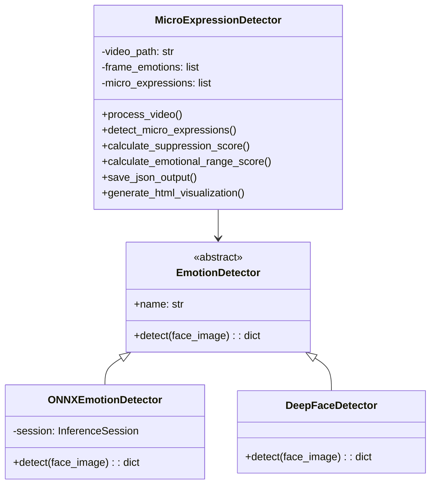

### Supported Emotions
- Angry, Disgust, Fear, Happy, Sad, Surprise, Neutral

## Requirements

- Python 3.8+
- OpenCV
- ONNX Runtime
- NumPy

## Demo

After running the script, open `emotion_timeline.html` in a web browser to view the interactive visualization.
