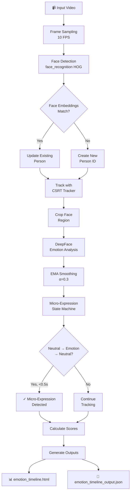
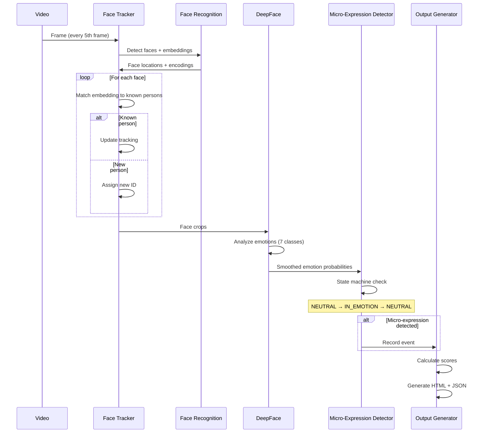
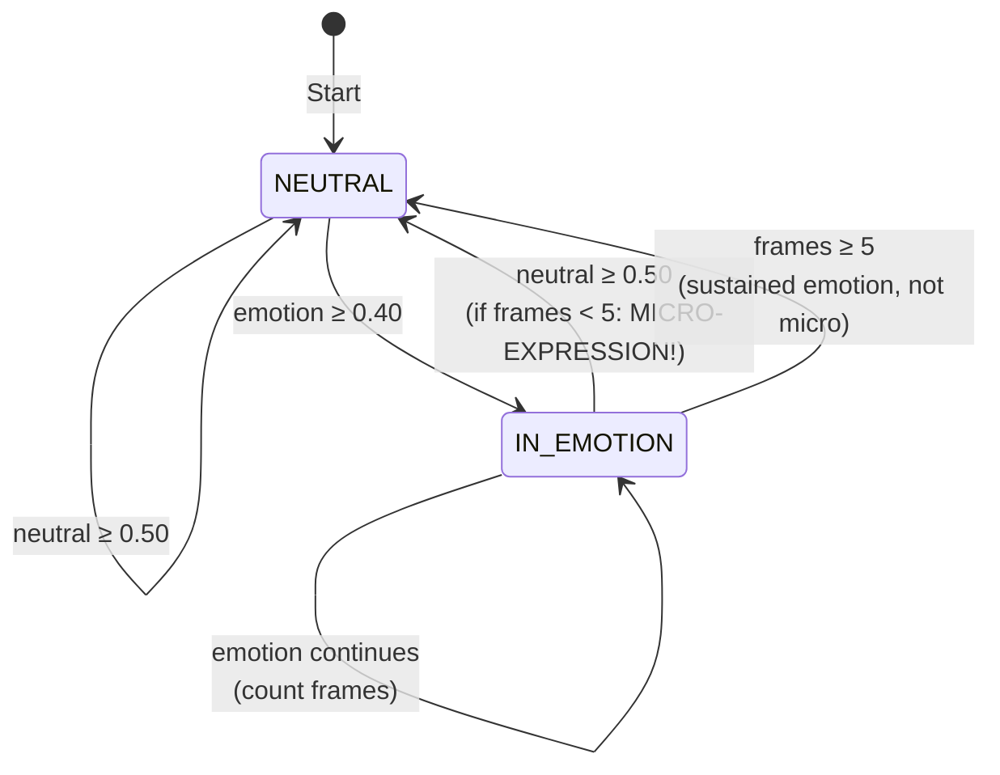

# Micro-Expression & Emotion Transition Timeline Analyzer

A computer vision system that detects sub-second emotion flashes (micro-expressions) and tracks emotion transitions across multiple persons in video. Generates interactive visualizations and JSON data for integration with Sentio Mind reports.

---

## Demo video
- https://drive.google.com/file/d/1JK0_J-XDtfod9wgp3bzPfSt1V3Q-TYDZ/view?usp=sharing

## Problem Statement

Traditional emotion analysis computes one dominant emotion per frame, missing **micro-expressions** — genuine emotional flashes lasting < 0.5 seconds that are immediately suppressed. These brief emotional leaks are critical stress signals invisible to single-frame analysis.

### Challenges Addressed:
- **Micro-expression Detection**: Emotions appearing suddenly (≥40% probability) for <0.5s, preceded and followed by neutral state
- **Multi-Person Tracking**: Robust identification of multiple individuals using face embeddings, preventing duplicate counting
- **Real-time Metrics**: Computing Suppression Score and Emotional Range Score per person
- **Offline Visualization**: Interactive river charts with Chart.js bundled inline (no CDN dependencies)

---

## Solution Approach

### Architecture Overview



### Processing Pipeline



---

## Features

### 1. Multi-Person Tracking with Face Embeddings
- Uses `face_recognition` library for robust person re-identification
- Prevents duplicate counting (420 → 24 persons in classroom video)
- Handles temporary occlusions with embedding memory
- Running average embedding updates (80% old + 20% new)

### 2. Micro-Expression Detection
Implements exact specification:
- Non-neutral emotion appears with probability **≥ 0.40**
- Duration **< 0.5 seconds** (< 5 frames at 10 FPS)
- Preceded AND followed by **neutral (≥ 0.50)**

### 3. Two Key Metrics

| Metric | Description | Formula |
|--------|-------------|---------|
| **Suppression Score** (0-100) | How often emotions are suppressed | `frequency(40) + strength(30) + duration(30)` |
| **Emotional Range Score** (0-100) | Expression variety | `diversity(40) + variance(30) + transitions(30)` |

### 4. Optimizations
- **Frame Sampling**: 10 FPS (66% reduction from 30fps video)
- **Hybrid Tracking**: Full detection every 5 frames, CSRT tracking between
- **EMA Smoothing**: Reduces noise while preserving rapid changes (α=0.3)
- **Batch Processing**: Memory cleanup every 32 frames

### 5. Offline HTML Report
- Chart.js bundled inline (downloaded once, cached locally)
- Per-person tabs with emotion river charts
- Vertical dashed lines marking micro-expression events
- No external CDN dependencies

---

## Installation

### Requirements
```bash
pip install -r requirements.txt
```

**requirements.txt:**
```
opencv-python
numpy<2
Pillow
deepface
face_recognition
tf-keras
tqdm
```

### Additional Dependencies (if face_recognition fails)
```bash
pip install cmake
pip install dlib
pip install face_recognition
```

---

## Usage

### Basic Usage
```bash
python solution.py path/to/video.mov
```

### Example
```bash
python solution.py "/teamspace/uploads/Class_8_cctv_video_1.mov"
```

### Output Files
| File | Description |
|------|-------------|
| `emotion_timeline.html` | Interactive visualization with per-person tabs |
| `emotion_timeline_output.json` | Structured data for Sentio Mind integration |

---

## Sample Results

### Video Analysis: Classroom with 24 Students (122.5s)

```
Analysis complete:
  Total persons detected: 24
  Total micro-expressions: 436

Person 5 (Highest Micro-expressions):
  Frames analyzed: 1252
  Micro-expressions: 35
  Suppression Score: 66.22
  Emotional Range Score: 88.57

Person 18 (Lowest Activity):
  Frames analyzed: 31
  Micro-expressions: 0
  Suppression Score: 0.00
  Emotional Range Score: 18.52
```

### Score Interpretation

| Suppression Score | Interpretation |
|-------------------|----------------|
| 0-30 | Low stress, natural expression |
| 30-60 | Moderate suppression |
| 60-100 | High suppression, potential stress indicator |

| Emotional Range | Interpretation |
|-----------------|----------------|
| 0-30 | Limited expressiveness |
| 30-60 | Moderate variety |
| 60-100 | Highly expressive |

---

## JSON Output Schema

```json
{
  "schema_version": "1.0",
  "analysis_metadata": {
    "video_file": "Class_8_cctv_video_1.mov",
    "video_duration_seconds": 122.52,
    "total_persons_detected": 24,
    "analysis_fps": 10
  },
  "person_profiles": {
    "1": {
      "person_id": 1,
      "first_seen_seconds": 0.0,
      "last_seen_seconds": 122.5,
      "emotion_timeline": {
        "scores": {
          "suppression_score": 52.52,
          "emotional_range_score": 88.57
        },
        "micro_expressions": [
          {
            "id": 1,
            "start_time": 2.345,
            "end_time": 2.678,
            "emotion": "surprise",
            "peak_probability": 0.67
          }
        ],
        "timeline": [
          {
            "timestamp": 0.0,
            "emotions": {"angry": 0.01, "happy": 0.15, "neutral": 0.72, ...},
            "dominant_emotion": "neutral",
            "is_micro_expression": false
          }
        ]
      }
    }
  }
}
```

---

## Technical Details

### State Machine for Micro-Expression Detection



### Face Matching Algorithm

```python
# For each detected face:
1. Compute 128-dimensional face embedding
2. Compare against all known embeddings using Euclidean distance
3. If distance < 0.6: Match to existing person
4. Else: Create new person ID
5. Update embedding: 0.8 * old + 0.2 * new (running average)
```

---

## Project Structure

```
ComputerVision/
├── solution.py                 # Main analysis script
├── requirements.txt            # Python dependencies
├── README.md                   # This file
├── .chartjs_cache.js          # Cached Chart.js (auto-generated)
├── emotion_timeline.html       # Output: Interactive visualization
└── emotion_timeline_output.json # Output: Integration data
```

---

## Limitations

1. **Face Detection**: May miss faces at extreme angles or with heavy occlusion
2. **Lighting**: Performance degrades in poor lighting conditions
3. **Processing Time**: ~10-15 minutes for 2-minute video with 24 persons
4. **Memory**: Large videos may require batch processing adjustments

---

## References

- [DeepFace](https://github.com/serengil/deepface) - Emotion analysis
- [face_recognition](https://github.com/ageitgey/face_recognition) - Face embeddings
- [Chart.js](https://www.chartjs.org/) - Visualization
- [OpenCV](https://opencv.org/) - Video processing and tracking

---

